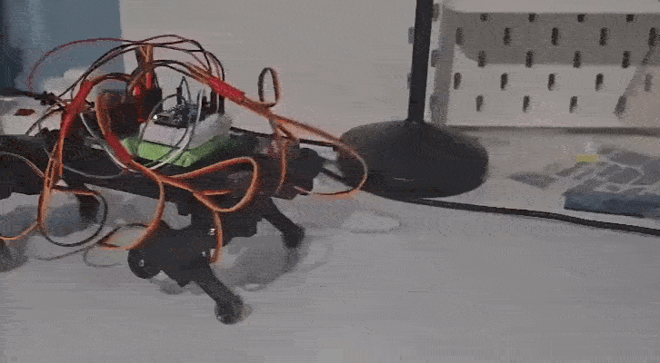
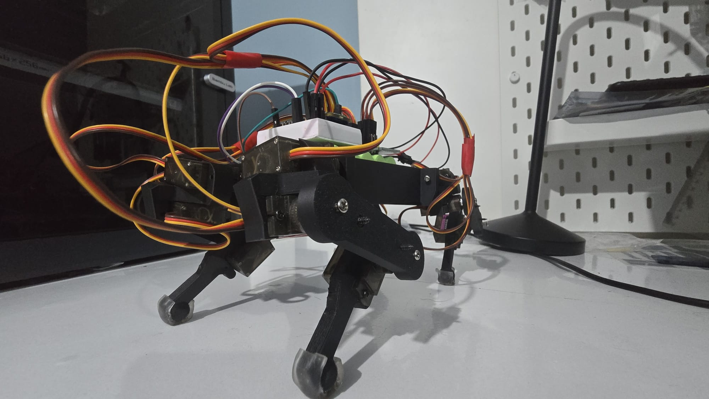
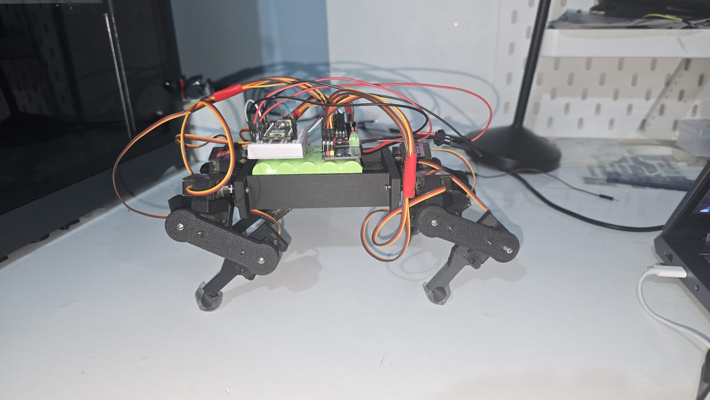

# ESP32 Quadruped Robot — Inverse Kinematics, PCA9685 Control

A four-legged walking robot built from scratch as a solo project in my first year of General Engineering at KCL — covering mechanical leg design, electronics, and gait control firmware, within a self-imposed £100 budget.

Each leg has 3 degrees of freedom (hip, thigh, knee), driven directly by its own servo — 12 DOF in total — all coordinated from a single ESP32 running a trot gait.

## Full Demo + Gallery 

click for a full demo video below

---

## Specs

| | |
|---|---|
| Degrees of freedom | 12 (3 per leg) |
| Weight | 400 g |
| Cost | £98 (budget: £100) |
| Microcontroller | ESP32 |
| Servo driver | PCA9685 (PWM) |
| Firmware | C++ |
| CAD | Fusion 360 |
| Manufacturing | 3D printing (FDM) |

---

## Overview

The goal was to design, build, and program a quadruped from the ground up — mechanical leg design, electronics, and gait control firmware — while staying lightweight and within budget. Each leg is a 3-DOF serial (open-chain) linkage, with servo horns directly actuating each joint in sequence.

## How It Works

### Mechanical
The 3-DOF legs are serially linked, with direct-drive servos at the hip, thigh, and knee. Link lengths and joint ranges were modelled in Fusion 360 and iterated for a stable foot trajectory and good ground clearance.

### Electronics
All 12 servos are powered by an ESP32 via a PCA9685 servo driver over PWM, with a dedicated power supply.

### Firmware
Written in C++. Implements a trot gait with adjustable stride length, step height, speed, and phase offsets between legs, using inverse kinematics and interpolation to produce smooth foot arcs. Servo calibration and gait parameters are tuned via bench testing.

### Build
Chassis and leg links are 3D-printed (FDM), assembled and iteratively tested to reduce foot slip. Servos are mounted with M1.5–M2 screws, and nano gel foot attachments are used to improve grip.

---

## Tools & Tech

`ESP32` · `C++` · `PWM Servo Control` · `Fusion 360` · `3D Printing (FDM)`

---

## Limitations & Future Improvements

- **Lateral oscillation during gait** — the quadruped oscillate sideways while walking longer strides. Planned fix: redesign the leg linkage as a 4-bar linkage to reduce limb inertia and increase mechanical advantage, improving stability.
- **IMU auto-levelling** — to further improve stability during walking.
- **Additional gaits** — bound and crawl, alongside the current trot.
- **Frame redesign** — for better cable management and rigidity.
- **Basic object detection** — ultrasonic or LiDAR sensing.

---
